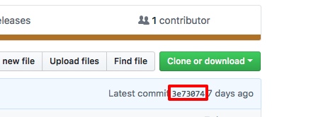

# EX06: Loops #

## Exercise Outcome ##

This exercise gives you practice in writing different kinds of loops.

## Doing the Exercise ##

You can start this exercise by clicking on the icon which should start the Keil tools. If you look at the source file **main.s** you will find all of the problems described in the comments. Make sure you read the comments *carefully* since there are requests to get data from different areas in the code.

## Testing the Exercise ##

This exercise is configured to use the simulator. You do not need the hardware to complete this assignment. Run the code under the debugger to make sure that it works correctly.

## Submitting Your Exercise ##

A big advantage to using git (and GitHub) is that you don't have to submit anything if your exercise is completed on time. The system will automatically record the current master branch at the time the exercise is due. I will expect to see at least four commits to your repo (made by you) which will show me that you've been working on the exercise.

Make sure that you have pushed all your changes to your repository since **the only work that counts is what you push to your GitHub repository**. The system will turn in your work automatically on the due date.

## Submitting Your Exercise Late ##

If you need to turn your exercise in late then you must type the first seven digits of the commit (technically the hash) you want to submit into the text box on the exercise page. You can find the first seven digits by looking on your repo page. It's the number shown in the red box.

If you are not sure ask me or the LTAs for help. Note that the date that it is considered turned in is the Git branch commit date or the hash entered date; whichever is **later**.

## Grading the Assignment ##

Code correctness is what I'll be looking for primarily. I will also be checking the comments to see that you've added your name and information in the proper place.

If you have any questions please don't hesitate to ask me in class or the lab.
