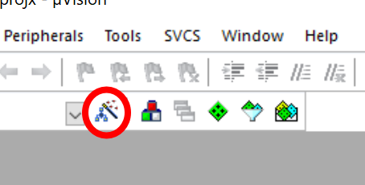
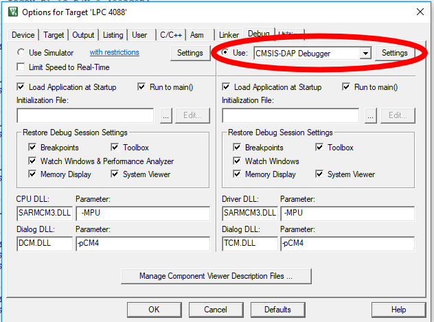
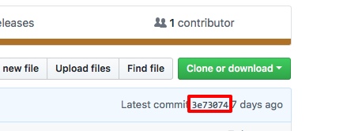

# L02: LED #

## Lab Outcome ##

You will first get some code running on the hardware. The program given will light up a bright blue LED that is on our LPC 4088 quickstart board. Once that is running you'll modify this code to work with a multiple color LED that is on our experimental base board. This LED is actually three LEDs (R, G, B) all together in one package. By turning each one on and off you can get some different colors.

## Lab Procedure ##

### Start the Project ###

Once you've cloned the GitHub repo into your local system navigate your way to the directory and double-click on the &mu;Vision icon. This should start the Keil &mu;Vision IDE. Spend a moment familiarizing yourself with the layout.

### Connect the Hardware ###
Check out a board from the LTA, tutor, or instructor. The board should have a USB cable connected to it when you take it out of the bag (which you should put in back into when you're done). Find the power supply connect near your monitor and connect it to the lab board first. Then connect the USB cable to your PC.

Once the PC recognizes the board you might see a few notifications from windows. That's normal.

In order to connect the board to the PC we need to configure the debug interface. You'll only need to do this once per project. If you get a download error this is what you need to check. First, select **Options for Download**. This is located by clicking on the icon highlighted below.

This will bring up a modal dialog called **Options for Target 'LPC 4088'**. Click on the tab labeled **Debug**. Make sure that the radio button is selected and the drop down menu is set to **CMSIS-DAP Debugger** as shown below. This will allow the PC to talk to the hardware. Once selcted make sure you press **OK** for both dialog boxes. Once that is done you can proceed to the Run It! section.

### Run It! ###

Build the code by selecting **Project -> Build Target**. Look at the build output window and you should see 0 Errors and 0 Warnings. Don't download any code to your hardware if you have any errors or warnings showing. The only warning that is acceptable is if it warns you that it has padded your code.

Download the code to the hardware by choosing **Flash -> Download** from the menu. You should see activity in the **Build Output** window. When it says "Programming Done" followed by a "Verify OK" you are good to go.

Start a debug session by selecting the **Debug -> Start/Stop Debug Session**. The windows will rearrange into a debug format. The run the code by selecting the **Debug -> Run** menu item. Stop it by choosing the **Debug -> Stop** menu item. Note that all of these commands have icon equivalents.

Once run is chosen the code will start running. Observe what the LED does on the hardware. It should be pretty noticeable.

After you have observed what has happened change the code in `main.s` so that the opposite case occurs with the LED. **Be sure to commit this to your GitHub repo**. There needs to be evidence that you changed the code to the opposite case. You should state as much in the commit message. Run the code and observe the change in LED state. After doing this you should be ready to do some more extensive modifications to the code.

## Modify the Project ##

The quickstart board LED is nice to control but there is a much better LED on the experimental base board. This LED is actually a package consisting of a Red LED and Blue LED and a Green LED. By setting each of these in combination we can get different colors. Your job is to change the code so that you can display REG, GREEN, BLUE and two other colors of your choice (not white or black). You will only be able to display one color at a time and will have to reassemble each time. That's fine.

You must use `EQU` statements for all constants including colors. You shouldn't need any variables and the logic is *very* similar to what you've been given.

Note:
* RED LED is attached to Port 1 Pin 11 (P1.11)
* GREEN LED is attached to P1.5
* BLUE LED is attached to P1.7
* To activate an LED you send it a zero (LOW) rather than a one (HIGH).

You can look up the relevant addresses using the LPC408x/407x User manual. This should be available in the CS 107 folder.

### Disconnect the Hardware ###
To disconnect the hardware you should eject the USB device from the PC (look for DAP Link). Once you get notified by windows that it's ejected unplug the USB **first** and then unplug the power. Leave the USB connected the the ARM board and coil the wire. Put all of it in the static bag and put it in the box. You're done! Be sure that you have been doing commits as you've worked on the assignment and you've pushed to origin. **The only work that counts is what is pushed to your GitHub account.**

## Submitting Your Assignment ##

A big advantage to using git (and GitHub) is that you don't have to submit anything if your assignment is completed on time. The system will automatically record the current master branch at the time the assignment is due. I will expect to see multiple commits to your repo which will show me that you've been working on the assignment.

Make sure that you have pushed all your changes to your repository since **the only work that counts is what you push to your GitHub repository**. After you've pushed your assignment to your repository you can go to the assignment page and type anything into the text box. You can say "I'm Done", your pipeline username, anything. The system will turn in your work automatically on the due date.

## Submitting Your Assignment Late ##

If you need to turn your assignment in late then you must type the first seven digits of the commit (technically the hash) you want to submit into the text box on the assignment page. You can find the first seven digits by looking on your repo page. It's the number shown in the red box.

If you are not sure ask me or the LTAs for help. Note that the date that it is considered turned in is the Git branch commit date or the hash entered date; whichever is **later**.

## Grading the Assignment ##

The big LED must change color correctly on the hardware. Additionally, EQUs must be used for the constants and there must be comments describing what has been changed and why. Lastly, you must delete any code that is not used to implement your solution. This only applies to `main.s`. If you have any questions please don't hesitate to ask me in class or the lab.
