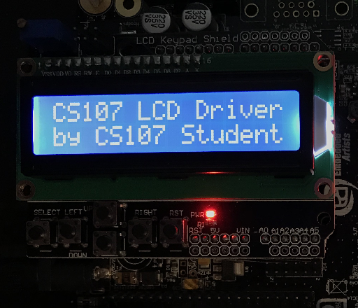

# L03: LCD Driver #
<!-- 50 points -->

**READ THIS WHOLE LAB BEFORE STARTING IT**

The purpose of this lab is to write a driver for the LCD Keypad Shield. This module is used by a main module to write out two lines of text on the LCD display. This lab uses skills learned in the previous lab as well as memory mapped I/O concepts, branching, and looping.

## Lab Outcome ##

The outcome of the lab is writing text to the LCD screen using the device driver that you have written. Your text should look like the picture below but with as much of your name as possible fitting into the space of the text "CS107 Student".

## Lab Procedure ##

### Start the Project ###

Once you've cloned the GitHub repo into your local system navigate your way to the directory and double-click on the &mu;Vision icon. This should start the Keil &mu;Vision IDE.

### Write the Code ###

You will spend most of your time writing the device driver `lcd.s`. `lcd.s` depends upon `delay.s` but that is a very simple module to write.

To write `lcd.s` I would recommend that you first write `LCD_INIT` but only the part the configures all of the ports. Next, I would write the `LCD_BACKLIGHT` routine and comment stuff in `main.s` until you only have the `LCD_INIT` and `LCD_BACKLIGHT` routines present. This can run on the hardware (after some minor issues have been resolved) and it should turn on the LCD backlight which you'll be able to see in the hardware.

I would next work on the `SET_E` and `SET_RS` routines since those are simple and involve only one aspect of the hardware. I would then focus on `WRITE_LS_NYBBLE` since that is probably the most complex thing to write. I would then turn to `WRITE_COMMAND` so you can return to `LCD_INIT` and add the LCD initialization sequence mentioned on the web page in Canvas called **LCD Driver Initialization Sequence**. At this point you can test the initialization and you should get the display to light up and have a flashing cursor.

Finish off the remaining routines and test your code. If you need a refresher on connecting to the hardware or running your code please see Lab 02.

## Submitting Your Assignment ##

A big advantage to using git (and GitHub) is that you don't have to submit anything if your assignment is completed on time. The system will automatically record the current master branch at the time the assignment is due. I will expect to see multiple commits to your repo which will show me that you've been working on the assignment.

Make sure that you have committed all your changes to your master branch and then pushed that branch to origin since **the only work that counts is what you push to your GitHub repository**. The system will turn in your work automatically on the due date.

## Submitting Your Assignment Late ##

If you need to turn your assignment in late then you must type the first seven digits of the commit (technically the hash) you want to submit into the text box on the assignment page. You can find the first seven digits by looking on your repo page. It's the number shown in the red box.

If you are not sure ask me or the LTAs for help. Note that the date that it is considered turned in is the Git branch commit date or the hash entered date; whichever is **later**.

## Grading the Assignment ##

I will be looking at your commit history to ensure that you have been working on the project. I expect to see multiple commits not just one giant commit at the end.

I will also load your code in the hardware and make sure that it works. Functionality is a big part of this assignment.
